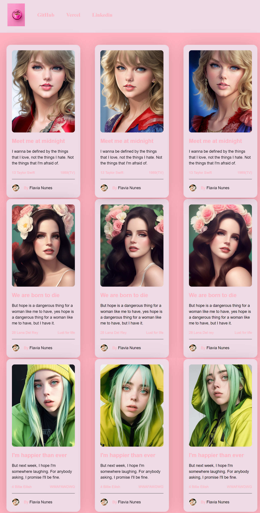

<h1 align="center">COFFE CARD</h1>

<h5 align="justify">Site desenvolvido baseado no desafio "Card NFT" - Frontend Mentor challenge, proposto pelo professor <a href="https://github.com/fabioivi/STAEM/commits?author=fabioivi">Fábio Duarte</a>

<a href="https://portifolio-psi-liart.vercel.app/">Link de demonstração</a><a href="https://github.com/bugFlavia/Portifolio/issues">Reporte problemas</a><a href="https://github.com/bugFlavia/Portifolio/pulls">Sugestões</a>

<ul><h1>⚙️Tecnologias</h1>
<li>Java Script Vanilla</li>
<li>CSS responsivo</li>
<li>HTML 5</li>
</ul>

